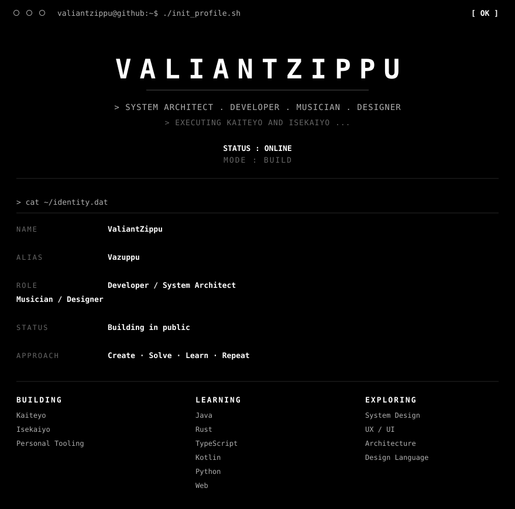
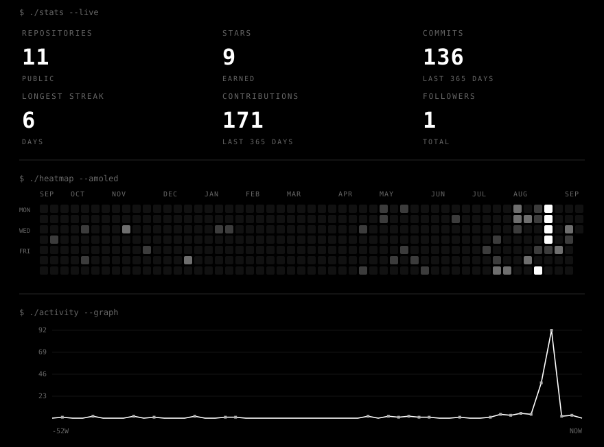

<!-- ===================================================================== -->
<!--  VALIANTZIPPU :: TERMINAL PROFILE — ONE CONTINUOUS BLOCK              -->
<!--  Single raw-HTML chunk: no blank lines => GitHub inserts no paragraph -->
<!--  margins, so panels stack seam-tight into one black terminal window.  -->
<!--  Data layer: scripts/generate_profile.py -> assets/generated/         -->
<!--  Developer docs: docs/DEVELOPMENT.md                                  -->
<!-- ===================================================================== -->

 cat ~/identity.dat — NAME ValiantZippu, ALIAS Vazuppu, ROLE Developer / System Architect / Musician / Designer — BUILDING Kaiteyo Isekaiyo Personal Tooling — LEARNING Java Rust TypeScript Kotlin Python Web — EXPLORING System Design UX/UI Architecture Design Language"> 
<a href="#about">[ ABOUT ]</a> &nbsp; <a href="#projects">[ PROJECTS ]</a> &nbsp; <a href="#stats">[ STATS ]</a> &nbsp; <a href="#toolkit">[ TOOLKIT ]</a> &nbsp; <a href="#contact">[ CONTACT ]</a> 
 
 
 
 
 

<b>▸ EXPAND DETAILED ANALYTICS</b>

 
 
 
 
 
 

