<!-- ===================================================================== -->
<!--  VALIANTZIPPU :: TERMINAL PROFILE                                     -->
<!--  The interface. Data layer lives in scripts/ + assets/generated/.     -->
<!--  Regenerated automatically by .github/workflows/update-profile.yml    -->
<!--  Developer docs: docs/DEVELOPMENT.md                                  -->
<!-- ===================================================================== -->

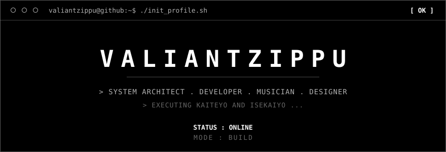

<a href="#about">[ ABOUT ]</a> &nbsp; <a href="#projects">[ PROJECTS ]</a> &nbsp; <a href="#stats">[ STATS ]</a> &nbsp; <a href="#toolkit">[ TOOLKIT ]</a> &nbsp; <a href="#contact">[ CONTACT ]</a>

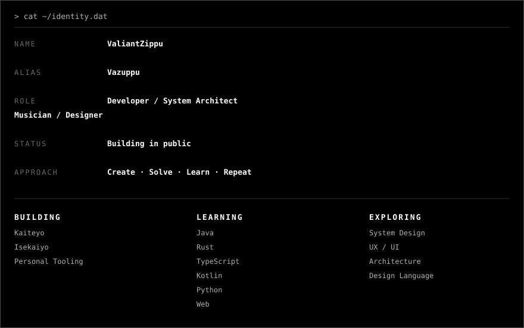 cat ~/identity.dat — NAME ValiantZippu, ALIAS Vazuppu, ROLE Developer / System Architect / Musician / Designer, STATUS Building in public — BUILDING Kaiteyo Isekaiyo Personal Tooling — LEARNING Java Rust TypeScript Kotlin Python Web — EXPLORING System Design UX/UI Architecture Design Language">

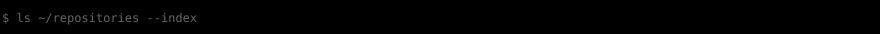

<a href="https://github.com/ValiantZippu/Kaiteyo">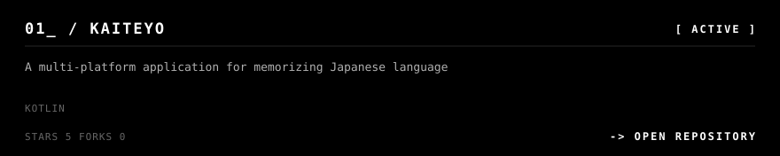</a>

<a href="https://github.com/ValiantZippu/Isekaiyo">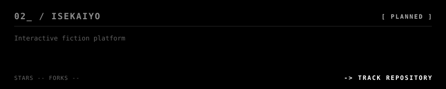</a>

<a href="https://github.com/ValiantZippu/Donyuyo">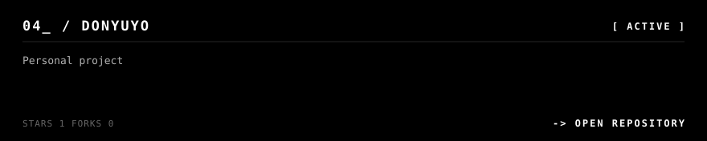</a>

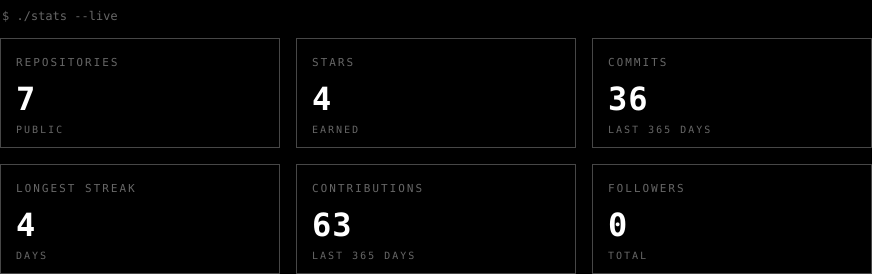

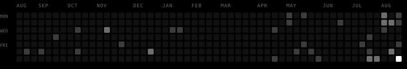

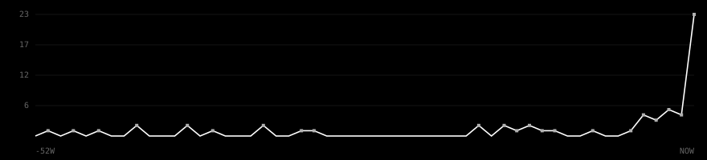

<b>▸ EXPAND DETAILED ANALYTICS</b>

 

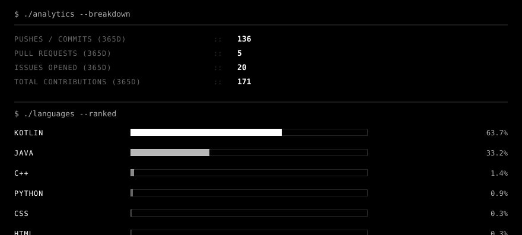

 

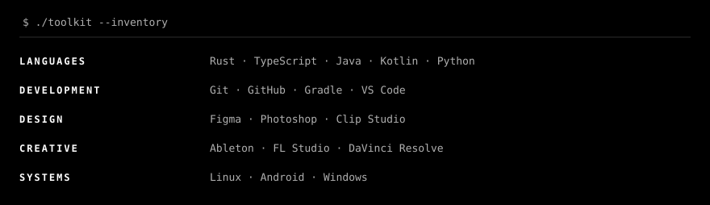

<a href="https://github.com/ValiantZippu">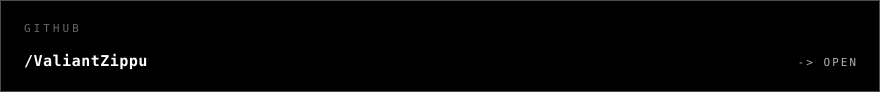</a>

<a href="mailto:emailzippu@gmail.com">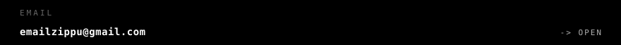</a>

<a href="https://idontworkforothers.com">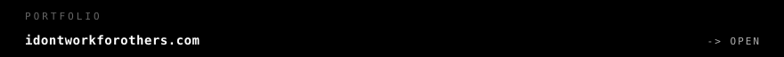</a>

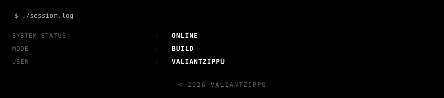

